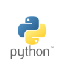
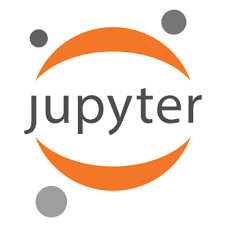
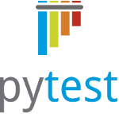
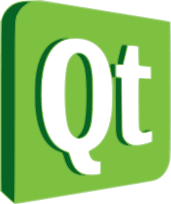

# Pytuguês

O pytugues é um projeto criado pelo Prof.Fábio Macedo Mendes, com o propósito de facilitar o aprendizado da linguagem python através de um sistema interativo e com comandos na lingua portuguesa.

## Tecnologias Utilizadas

Lista de tecnologias utilizadas por este projeto em sua manutenção.

</img></a>
</img></a>
</img></a>
</img></a>

## Equipe

|                 Nome                 |             Email            |        GitHub       |
|:------------------------------------:|:---------------------------:|:-------------------:|
| Cecilia França Dib de Oliveira Bessa |  [ceciliabessa@hotmail.com]() |    [@ceciliadib](https://github.com/ceciliadib)    |
| Geison de Souza Oliveira | [geisonszo@gmail.com]() | [@geisonszo](https://github.com/geisonszo) |
| Hugo Ferreira Martins | [hugomartins_15@hotmail.com]() | [@hugomartins013](https://github.com/hugomartins013)
|  Júlio César Xavier Portela de Souza |   [julioxavierr@gmail.com]()  |   [@julioxavierr](https://github.com/julioxavierr)   |
| Phelipe |  | [@pwener](https://github.com/pwener) |
| Rafael Contessotto Braganca Pinheiro | [rabragancaunb@gmail.com]() | [@rafaelbrg](https://github.com/rafaelbrg) |
| Rudmar Rodrigues Campos Júnior |   [rudmar_junior@hotmail.com]()  |   [@Rudmar](https://github.com/Rudmar)   |
| Ulysses Bernard Mendes Lara | [ulysses3353@gmail.com]() | [@ulyssesBML](https://github.com/rafaelbrg) |

## Product Owner

|                 Nome             |        GitHub       |
|:------------------------------------:|:---------------------------:|:-------------------:|
| Fábio Macêdo Mendes|   [@fabiommendes](https://github.com/fabiommendes)    |
